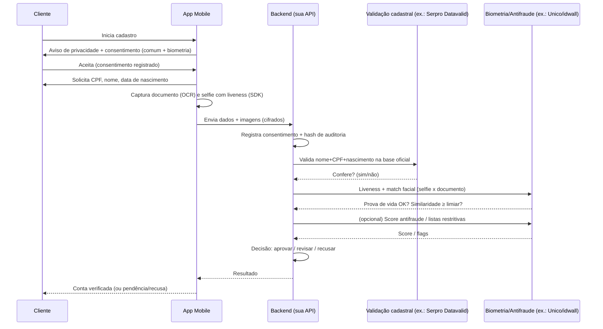

# Fluxo de KYC com Biometria — App Mobile (conforme LGPD)

> Documento de design para um fluxo de **Know Your Customer (KYC)** de
> identificação e verificação de clientes em **aplicativo mobile**, com
> **prova de vida (liveness)** e **comparação facial**, em conformidade com a
> **Lei Geral de Proteção de Dados (Lei 13.709/2018 — LGPD)**.
>
> Escopo: verificação de identidade fornecida **pelo próprio cliente**, com
> consentimento e finalidade declarada. Não cobre — e é incompatível com —
> qualquer consulta a dados de terceiros sem base legal.

## 1. Princípio central

A diferença entre KYC legítimo e o mercado ilícito de "consulta de CPF" é a
direção do dado:

- **KYC legítimo**: o cliente **fornece** o próprio CPF, data de nascimento e
  biometria; você apenas **valida e confirma** contra fontes oficiais.
- **Ilícito**: alguém **descobre** dados de quem não autorizou.

Todo o fluxo abaixo parte do dado que o titular entregou e existe para
**confirmar que a pessoa é quem diz ser**.

## 2. Bases legais e princípios LGPD aplicados

| Princípio (art. 6º) | Como o fluxo atende |
|---|---|
| Finalidade | Verificar identidade para abertura/uso da conta. Declarada antes da coleta. |
| Adequação / Necessidade | Coleta **mínima**: só os campos exigidos para a verificação (ver §5). |
| Livre acesso e qualidade | Cliente pode consultar e corrigir seus dados. |
| Transparência | Aviso de privacidade claro antes da captura. |
| Segurança / Prevenção | Criptografia, controle de acesso, logs de auditoria. |
| Não discriminação | Decisão de recusa revisável por humano; sem viés automatizado oculto. |
| Responsabilização | Registro de consentimento + trilha de auditoria. |

**Base legal recomendada** (art. 7º / art. 11 para dado sensível):

- Dado pessoal comum (nome, CPF, nascimento): **execução de contrato**
  (art. 7º, V) e/ou **cumprimento de obrigação legal/regulatória**
  (art. 7º, II) — ex.: regras de PLD/FT (Prevenção à Lavagem de Dinheiro)
  da instituição.
- **Dado biométrico = dado pessoal sensível** (art. 5º, II). Exige base do
  art. 11 — em geral **consentimento específico e destacado** (art. 11, I)
  ou obrigação legal/regulatória (art. 11, II, "a"). **Sempre** colete
  consentimento explícito e separado para a biometria.

## 3. Arquitetura do fluxo

```
┌──────────────┐         ┌──────────────────┐         ┌─────────────────────┐
│  App Mobile  │  HTTPS  │   Seu Backend    │  HTTPS  │   Provedores KYC     │
│ (iOS/Android)│ ──────▶ │  (API + Orquestr.)│ ──────▶ │  (Serpro/idwall/...) │
└──────┬───────┘  mTLS   └────────┬─────────┘         └─────────────────────┘
       │                          │
       │ SDK de captura           │ Vault de segredos
       │ (liveness/OCR)           │ Banco cifrado + audit log
       ▼                          ▼
  Câmera/Documento          Armazenamento mínimo + retenção
```

Pontos-chave de arquitetura:

- **O app nunca chama os provedores de KYC diretamente.** Toda credencial de
  API fica no backend; o app fala só com a sua API. Isso evita expor chaves e
  centraliza auditoria.
- **SDK de captura no app** (do provedor de biometria) cuida de liveness e
  qualidade da imagem; envia o resultado cifrado ao backend.
- **Orquestração no backend**: o backend chama, em sequência, validação
  cadastral → biometria → antifraude, e toma a decisão.

## 4. Etapas do fluxo (sequência)



Estados possíveis da decisão: **aprovado**, **em revisão manual**
(borderline — sempre com revisão humana possível, art. 20 LGPD) e
**recusado** (com motivo registrado e direito de revisão).

## 5. Dados coletados (minimização)

Colete **apenas**:

| Campo | Finalidade | Sensível? |
|---|---|---|
| Nome completo | Validação cadastral | Não |
| CPF | Validação cadastral | Não* |
| Data de nascimento | Validação cadastral | Não |
| Imagem do documento (RG/CNH) | OCR + match facial | Não** |
| Selfie + frames de liveness | Prova de vida + match facial | **Sim (biométrico)** |
| Metadados técnicos (device, timestamp, IP) | Antifraude / auditoria | Não |

\* CPF não é "sensível" na LGPD, mas é dado pessoal e exige proteção forte.
\** A imagem do documento pode conter dado sensível dependendo do conteúdo;
trate com o mesmo rigor da biometria.

**Não** colete dados não necessários (renda, filiação, etc.) só "para ter".

## 6. Provedores no Brasil (categorias)

- **Validação cadastral oficial**: **Serpro Datavalid** (valida CPF, nome,
  nascimento e biometria contra a base da Receita/Denatran).
- **Biometria / prova de vida / match facial**: **Unico (idCloud)**, **idwall**,
  **CAF (ex-Combate à Fraude)**.
- **Antifraude / score / listas restritivas (PEP, sanções)**: **ClearSale**,
  **Serasa Experian**, **idwall**.

A escolha depende de volume, SLA e se você quer um provedor único (suite) ou
melhor-da-categoria por etapa. Todos exigem **contrato e DPA (acordo de
tratamento de dados)** — formalize o papel de **operador** (art. 39 LGPD).

## 7. Registro de consentimento e auditoria

Para cada verificação, persista de forma imutável (ex.: tabela append-only ou
log assinado):

- Identificador do titular (pseudonimizado quando possível).
- Versão do **aviso de privacidade** e do **termo de consentimento** aceitos.
- Timestamp, IP e device do aceite.
- Escopo do consentimento (separado: dado comum vs. biometria).
- Resultado de cada chamada a provedor (sem armazenar a imagem além do
  necessário — guarde o **veredito** e um hash, não a foto, salvo exigência).
- Decisão final e quem/que regra a tomou.

## 8. Segurança e ciclo de vida do dado

- **Em trânsito**: TLS 1.2+; idealmente **mTLS** entre app e backend e entre
  backend e provedores.
- **Em repouso**: cifragem (AES-256). Segredos em **vault** (não em código nem
  em variáveis de ambiente versionadas).
- **Minimização de retenção**: defina prazo de guarda por finalidade. A
  biometria deve ser **descartada assim que cumprida a finalidade**, salvo
  obrigação legal de retenção (ex.: prazos de PLD). Documente o prazo.
- **Descarte seguro** ao fim do ciclo (art. 16 LGPD).
- **Controle de acesso** mínimo e segregado; trilha de quem acessou o quê.
- **Resposta a incidente**: plano de notificação à ANPD e aos titulares
  (art. 48) em caso de vazamento.

## 9. Direitos do titular (art. 18)

Implemente endpoints/processos para o cliente:

- Confirmar existência e **acessar** seus dados.
- **Corrigir** dados incompletos/errados.
- Solicitar **eliminação** dos dados tratados com consentimento.
- **Revogar consentimento** (especialmente da biometria).
- Pedir **revisão humana** de decisão automatizada de recusa (art. 20).

## 10. Exemplo de orquestração no backend (esboço)

> Pseudo-Python ilustrativo — substitua os clientes pelos SDKs reais dos
> provedores contratados. As chaves vêm do vault, nunca do código.

```python
async def verificar_cliente(payload: KycPayload) -> KycDecision:
    # 0. Pré-condição: consentimento válido (comum + biometria) já registrado
    if not consent_store.is_valid(payload.subject_id, scopes=["cadastral", "biometria"]):
        raise ConsentRequired()

    # 1. Registrar trilha de auditoria (imutável)
    audit.log("kyc_start", subject=payload.subject_id, consent_version=payload.consent_version)

    # 2. Validação cadastral contra base oficial
    cadastral = await datavalid.validar(
        nome=payload.nome, cpf=payload.cpf, nascimento=payload.nascimento
    )
    if not cadastral.confere:
        return decide("recusado", motivo="dados cadastrais não conferem")

    # 3. Prova de vida + match facial (selfie x documento)
    bio = await biometria.verificar(
        selfie=payload.selfie, documento=payload.documento_img
    )
    if not bio.liveness_ok:
        return decide("recusado", motivo="prova de vida falhou")
    if bio.similaridade < LIMIAR_FACIAL:        # ex.: 0.85
        return decide("em_revisao", motivo="similaridade facial limítrofe")

    # 4. (Opcional) Antifraude / listas restritivas
    risco = await antifraude.score(payload)
    if risco.flag_pep or risco.flag_sancoes:
        return decide("em_revisao", motivo="lista restritiva")
    if risco.score < LIMIAR_RISCO:
        return decide("recusado", motivo="score de risco baixo")

    # 5. Aprovação — descartar biometria conforme política de retenção
    biometria_store.schedule_purge(payload.subject_id)
    return decide("aprovado")


def decide(status: str, motivo: str = "") -> KycDecision:
    audit.log("kyc_decision", status=status, motivo=motivo)
    return KycDecision(status=status, motivo=motivo, revisao_humana=(status != "aprovado"))
```

## 11. Checklist de conformidade antes de ir para produção

- [ ] Aviso de privacidade e termo de consentimento (biometria em destaque).
- [ ] DPA assinado com cada provedor (papel de operador definido).
- [ ] Base legal documentada por categoria de dado.
- [ ] Política de retenção e descarte da biometria definida e implementada.
- [ ] Criptografia em trânsito e repouso; segredos em vault.
- [ ] Trilha de auditoria imutável de consentimento e decisões.
- [ ] Fluxo de revisão humana para recusas (art. 20).
- [ ] Endpoints de direitos do titular (acesso, correção, eliminação, revogação).
- [ ] Plano de resposta a incidentes (notificação ANPD).
- [ ] Relatório de Impacto à Proteção de Dados (RIPD/DPIA) — recomendado para
      tratamento de dado biométrico em escala.

---

**Aviso**: este documento é um guia técnico de arquitetura, não aconselhamento
jurídico. Valide o desenho final com o DPO/encarregado e a área jurídica antes
de produção.
